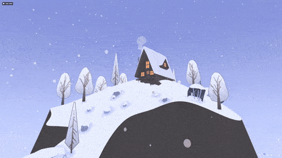
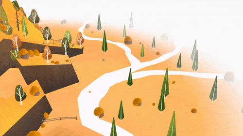
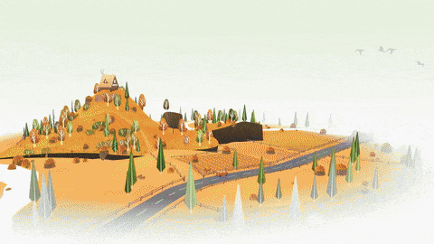
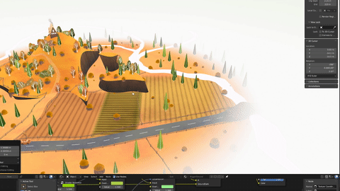

Procedural Stylized Scene Generator With Geometry Node in Blender 3D
=================

This repo contains Geometry nodes generating the images shown above. Both scenes are viewable downloadable on my sketchfab. You will find the [Autumn](https://skfb.ly/oCNu9) scene here and the [Winter](https://skfb.ly/oCBKI) here. 

I have covered the workflows and concepts in this blog post here: https://shahriyarshahrabi.medium.com/blender-geometry-nodes-create-stylized-scenes-e336967c7f84

To get the Winter scene, switch to the Master branch. The main branch only contains the Autumn demo scene. This was made and tested on Windows, Blender 3.4.1

---

Everything is done procedurally in the scene. That means you can easily model in the surfaces you want as top of the hill and the rest is taken care of by the geometry node: 

There are various procedural systems at play. Such as placement of the house, the roads, the rivers, the smoke and the fences. Here is an example of the fences: 

Since the colors are also fully procedural, and all controled through a few key colors positioned in a node group, you can easily look dev the whole scene. 

